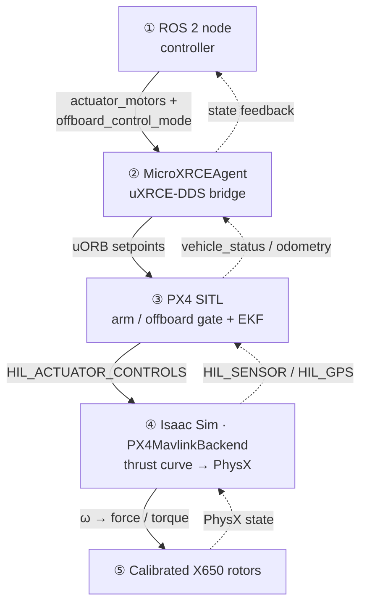

# Direct Thrust (PX4 Direct-Actuator) Simulation — Setup & Troubleshooting

## Architecture & data flow

X650 flown in Isaac Sim by PX4 SITL in OFFBOARD **direct-actuator** mode: a ROS 2 controller streams per-motor commands, PX4 only **gates** them (arm/offboard/saturation), Isaac is the **physics plant**, and state flows back to close the loop. Two transports bridge the halves — **uXRCE-DDS** (ROS 2 ⇄ PX4, UDP 8888) and **MAVLink HIL** (PX4 ⇄ Isaac, TCP 4560).



Solid = forward command path; dashed = feedback. The dashed edges close **two loops**: sensors
back to PX4's EKF, and vehicle state back to the controller (used closed-loop only in the hover test).

### Knots — role · key I/O

**① ROS 2 node** — generates the motor commands (open-loop pulses for the pinned test, closed-loop cascade for hover) and declares direct-actuator mode.
- in — vehicle state feedback (pose/twist/odometry, hover only); arming/nav status
- out — `fmu/in/actuator_motors` (4× u∈[0,1]) + `fmu/in/offboard_control_mode` (direct_actuator=true)

**② MicroXRCEAgent** — a bridge translating ROS 2 DDS topics ⇄ PX4 uORB over UDP 8888 (the only door between ROS 2 and PX4).
- in — `fmu/in/*` from the controller; `fmu/out/*` from PX4's DDS client
- out — uORB setpoints into PX4; `fmu/out/*` (status, odometry) to the controller

**③ PX4 SITL** — the safety gate + state estimator: forwards the motor commands only when armed **and** offboard, and runs the EKF (its own flight controllers are bypassed in direct mode).
- in — actuator/offboard setpoints (uORB); `HIL_SENSOR`/`HIL_GPS` (MAVLink 4560)
- out — `HIL_ACTUATOR_CONTROLS` to Isaac; `vehicle_status`/odometry to the controller

**④ Isaac Sim · PX4MavlinkBackend** — the physics plant: maps normalized commands → rotor ω → force/torque via the thrust curve and integrates the airframe in PhysX.
- in — `HIL_ACTUATOR_CONTROLS` (MAVLink 4560)
- out — `HIL_SENSOR`/`HIL_GPS` back to PX4; ROS 2 state topics to the controller

**⑤ Calibrated X650 rotors** — the vehicle model: 4 bench-calibrated rotors (force `k_f·ω²`, yaw `k_m·ω²`, optional spin-up lag) with CAD mass/inertia.
- in — per-rotor commanded ω (from the thrust-curve stage)
- out — forces + yaw torque on the airframe → rigid-body motion

### Two scenarios share this pipeline

| Scenario | Launcher | Isaac fixture | Controller |
|---|---|---|---|
| Pinned torque test | `scripts/start_x650_pinned_direct_actuator_test.sh` | `application/px4_base/04_x650_pinned_direct_actuator_test.py` (translation-clamped, writes `/tmp/x650_pinned_torque.csv`) | `~/ros2_ws/src/x650_direct_actuator_test_node.py` (equal/roll/pitch/yaw pulse sequence) |
| Free-flight hover | `scripts/start_x650_ros_offboard_hover_test.sh` | `application/px4_base/03_px4_single_drone_x650.py` | `apl20_ros autopilot_node` (PX4-style cascade) + persistent 1.5 m setpoint pub |

**What question does each answer?**

- **Pinned torque test** (open-loop) — *"Does a known motor command produce the physically correct body torque?"* The vehicle is pinned so it can only rotate; fixed roll/pitch/yaw motor patterns go in, and the measured angular acceleration is checked against the torque predicted from the rotor forces. Isolates and validates the thrust-curve calibration, rotor geometry, mixing signs, and the whole ROS 2 → PX4 → Isaac transport — no controller in the loop.
- **Free-flight hover** (closed-loop) — *"Does the full stack actually fly?"* The apl20 cascade controller flies the free vehicle (with the realistic lagged motor model) to a 1.5 m hover using state feedback. Validates that the calibrated plant + motor dynamics + PX4 gate + controller gains together produce stable flight.

**Never run both at once** — they collide on DDS namespace `uav_0`, MAVLink UDP 14540, and sim TCP 4560.

### Dependency tree — `start_x650_ros_offboard_hover_test.sh`

```text
start_x650_ros_offboard_hover_test.sh
├─ scripts/common_config.sh                      # load_machine_config + shared helpers
├─ scripts/terminal_utils.sh                     # open_new_terminal
├─ scripts/config/shiqi_machine.conf             # PX4_DIR, ISAAC_PY, FSC_PEGASUS_ROOT, FSC_AUTOPILOT_WS
├─ scripts/apply_aerial_manipulator_px4_offboard_params.sh
│                                                # sets UXRCE_DDS_SYNCT=0, disables HIL auto-disarm (via tmux)
│
├─ pane 1 · PX4 SITL
│   ├─ ~/PX4-Autopilot   →  make px4_sitl none_iris      # PX4 v1.16.0 firmware
│   └─ MicroXRCEAgent udp4 -p 8888                       # uXRCE-DDS bridge (ROS 2 ⇄ PX4)
│
├─ pane 2 · Isaac plant
│   ├─ ~/isaacsim/python_r_fsc.sh                        # ISAAC_PY (Isaac Sim python)
│   └─ application/px4_base/03_px4_single_drone_x650.py
│       ├─ pegasus.simulator                             # PegasusInterface, PX4MavlinkBackend, ROS2Backend, World
│       ├─ fsc_aerial_manipulation.rotorcraft.x650_bare_frame_utils   → spawn_x650_with_mavlink
│       │   ├─ fsc_aerial_manipulation.rotorcraft.lagged_thrust_curve → LaggedQuadraticThrustCurve
│       │   │   └─ pegasus.simulator … QuadraticThrustCurve            # base class
│       │   └─ extensions/…/rotorcraft/assets/x650.usd   # calibrated bare-frame asset
│       └─ fsc_aerial_manipulation.utils                 → add_dome_lighting
│
├─ pane 3 · Controller (apl20 cascade)
│   ├─ /opt/ros/humble/setup.bash
│   ├─ ~/ros2_ws/install/setup.bash                      # AUTOPILOT_SETUP; chains px4_msgs
│   ├─ ros2 run apl20_ros autopilot_node
│   │   ├─ ~/ros2_ws/src/apl20/apl20_ros                 # ROS 2 wrapper node (built)
│   │   │   ├─ apl20                                      # C++ core control lib (CMake ≥3.28)
│   │   │   └─ px4_msgs  (release/1.16, ~/workspaces/isaacsim)   # MUST match PX4 v1.16
│   │   └─ ~/ros2_ws/src/apl20/apl20_ros/config/x650.yaml # controller params (X650_PARAMS)
│   └─ params: auto_engage:=true, track_log:=/tmp/x650_ros_hover_track.csv
│
└─ pane 4 · Setpoint publisher
    └─ ros2 topic pub -r 20 /autopilot/setpoint_position/local  geometry_msgs/PoseStamped (z = 1.5 m)
```

## Motor dynamics (rotor spin-up model)

Whether the sim models motor delay depends on the thrust curve, and the two scenarios differ **on purpose**:

| Scenario | Thrust curve | Rotor delay |
|---|---|---|
| Free-flight hover (`03…`) | `LaggedQuadraticThrustCurve` | **Yes** — first-order spin-up lag |
| Pinned torque test (`04…`) | `QuadraticThrustCurve` | **No** — instantaneous, so measured angular accel maps directly to commanded torque |

The thrust-curve math lives in [`lagged_thrust_curve.py`](extensions/fsc_aerial_manipulation/fsc_aerial_manipulation/rotorcraft/lagged_thrust_curve.py) (a subclass of the stock `QuadraticThrustCurve`); every X650 constant lives in [`x650_bare_frame_utils.py`](extensions/fsc_aerial_manipulation/fsc_aerial_manipulation/rotorcraft/x650_bare_frame_utils.py) and is wired into the curve at [x650_bare_frame_utils.py:159-164](extensions/fsc_aerial_manipulation/fsc_aerial_manipulation/rotorcraft/x650_bare_frame_utils.py#L159-L164). Each equation below is tagged with its `↳ source` `file:line`.

### Command chain (per rotor _i_)

**1. PX4 normalized command → commanded rotor speed.** PX4 streams `ActuatorMotors.control[i] = u_i ∈ [0,1]`;
the Pegasus `PX4MavlinkBackend` maps it to a target angular velocity, then clamps it:

$$
\omega_{cmd,i} = (u_i + o_i)\,s_i + z_i \quad\xrightarrow{\text{X650 calib}}\quad \omega_{cmd,i} = 735.7537\,u_i + 81.8374 \;\;[\text{rad/s}]
$$

with offset $o_i=0$, scaling $s_i = \omega_{max}-\omega_{armed} = 735.7537$, armed-idle $z_i = 81.8374$;
then clamped to $[\omega_{min}, \omega_{max}] = [0,\ 817.5911]$ rad/s ($\omega_{min}=0$ so disarmed → true zero).

> ↳ **source** — affine map: [px4_mavlink_backend.py:173](extensions/pegasus.simulator/pegasus/simulator/logic/backends/px4_mavlink_backend.py#L173) · $s_i,z_i$ set: [x650_bare_frame_utils.py:132-133](extensions/fsc_aerial_manipulation/fsc_aerial_manipulation/rotorcraft/x650_bare_frame_utils.py#L132-L133) · $\omega_{armed}$ / $\omega_{max}$: [:57](extensions/fsc_aerial_manipulation/fsc_aerial_manipulation/rotorcraft/x650_bare_frame_utils.py#L57) / [:59](extensions/fsc_aerial_manipulation/fsc_aerial_manipulation/rotorcraft/x650_bare_frame_utils.py#L59) · clamp: [lagged_thrust_curve.py:77-79](extensions/fsc_aerial_manipulation/fsc_aerial_manipulation/rotorcraft/lagged_thrust_curve.py#L77-L79)

**2. First-order spin-up lag** (the "motor delay model", commit `d5f5dfb`; only `LaggedQuadraticThrustCurve`).
The rotor speed relaxes toward $\omega_{cmd}$ instead of jumping to it:

$$
\dot\omega_i = \lambda_i\,(\omega_{cmd,i} - \omega_i), \qquad \lambda = 10.51\ \text{s}^{-1},\quad \tau = 1/\lambda \approx 95\ \text{ms}
$$

> ↳ **source** — continuous model: [lagged_thrust_curve.py:25](extensions/fsc_aerial_manipulation/fsc_aerial_manipulation/rotorcraft/lagged_thrust_curve.py#L25) · $\lambda$ = `X650_ROTOR_LAMBDA`: [x650_bare_frame_utils.py:86](extensions/fsc_aerial_manipulation/fsc_aerial_manipulation/rotorcraft/x650_bare_frame_utils.py#L86)

Integrated per physics step with the **exact zero-order-hold discrete solution** (not Euler — this is
unconditionally stable for any $\lambda,\Delta t>0$):

$$
\omega_i[k{+}1] = \omega_{cmd,i}[k] + \big(\omega_i[k] - \omega_{cmd,i}[k]\big)\,e^{-\lambda_i \Delta t}
$$

> ↳ **source** — [lagged_thrust_curve.py:84-85](extensions/fsc_aerial_manipulation/fsc_aerial_manipulation/rotorcraft/lagged_thrust_curve.py#L84-L85) (`decay = exp(-λ·dt)`, then `_velocity[i] = target + (·)·decay`). The instantaneous (pinned) case collapses to $\omega_i[k] = \omega_{cmd,i}[k]$ — stock [`quadratic_thrust_curve.py`](extensions/pegasus.simulator/pegasus/simulator/logic/thrusters/quadratic_thrust_curve.py).

**3. Force & yaw torque** — quadratic in the **lagged** $\omega$ (never in the raw command):

$$
F_i = k_f\,\omega_i^2, \qquad \tau_{z} = \sum_i k_m\,\omega_i^2\,\mathrm{dir}_i
$$

$$
k_f = 4.536223\times10^{-5}\ \tfrac{\text{N}}{(\text{rad/s})^2}, \quad
k_m = 8.366\times10^{-7}\ \tfrac{\text{N·m}}{(\text{rad/s})^2}, \quad
\mathrm{dir} = (-1,-1,+1,+1)
$$

> ↳ **source** — $F_i$: [lagged_thrust_curve.py:94](extensions/fsc_aerial_manipulation/fsc_aerial_manipulation/rotorcraft/lagged_thrust_curve.py#L94) · $\tau_z$: [lagged_thrust_curve.py:97](extensions/fsc_aerial_manipulation/fsc_aerial_manipulation/rotorcraft/lagged_thrust_curve.py#L97) · $k_f$ = `X650_ROTOR_CONSTANT`: [x650_bare_frame_utils.py:68](extensions/fsc_aerial_manipulation/fsc_aerial_manipulation/rotorcraft/x650_bare_frame_utils.py#L68) · $k_m$ = `X650_ROLLING_MOMENT_COEFFICIENT`: [:69](extensions/fsc_aerial_manipulation/fsc_aerial_manipulation/rotorcraft/x650_bare_frame_utils.py#L69) · `dir` default `[-1,-1,1,1]`: [x650_bare_frame_utils.py:154](extensions/fsc_aerial_manipulation/fsc_aerial_manipulation/rotorcraft/x650_bare_frame_utils.py#L154)

### Notes / scope

- **What is modeled: actuator spin-up *lag* (bandwidth), not a pure transport *dead-time*.** There is no
  input time-delay (no $\omega_{cmd}(t-T_d)$) anywhere in the thrust path.
- $\lambda = 10.51$ is bench-measured — the mean of the MN4014+15×5″ report's `lag_all`/`lag_filtered`
  system-ID variants (the low-noise ones); $\tau\approx95$ ms sits inside the report's expected 70–200 ms.
- The value is **scale-invariant between RPM and rad/s** (both sides of $\dot\omega=\lambda(\omega_{cmd}-\omega)$
  scale by the same factor), so the report's per-minute λ applies directly to rad/s here.
- PX4↔Isaac also exchange commands over MAVLink each step, adding incidental loop latency — that is
  simulation plumbing, not part of the calibrated motor model above.
- Adding this lag is what forced the PX4 gain retune (softer rate/attitude loops); see the X650 notes in `CLAUDE.md`.

## One-time setup (state as of 2026-07-23, shiqi-desktop)

1. **CMake ≥ 3.28** (apl20 core lib requires it; Ubuntu 22.04 ships 3.22.1):
   ```bash
   python3 -m pip install --user "cmake~=3.28"   # → ~/.local/bin, first on PATH; pinned < 4.0
   hash -r
   ```
2. **px4_msgs version-matched to the firmware** — PX4 is v1.16.0, so px4_msgs **must** be on `release/1.16`:
   ```bash
   cd ~/workspaces/isaacsim/src/px4_msgs
   git fetch origin release/1.16 && git checkout -B release/1.16 FETCH_HEAD
   cd ~/workspaces/isaacsim
   source /opt/ros/humble/setup.bash
   colcon build --packages-select px4_msgs
   ```
   Sanity check: `diff msg/VehicleStatus.msg ~/PX4-Autopilot/msg/versioned/VehicleStatus.msg` → identical.
   ⚠ Other packages in that workspace (`fsc_autopilot_ros2`, `fsc_drone_state_estimator_ros2`, …) were built
   against the old messages and need rebuilding before next use.
3. **Build apl20** (hover-test controller), against the matched px4_msgs:
   
   ```bash
   source /opt/ros/humble/setup.bash
   source ~/workspaces/isaacsim/install/setup.bash
   cd ~/ros2_ws && colcon build --packages-up-to apl20_ros
   ```
4. **Test node in place** (pinned test only; run directly by python3, no colcon build needed):
   `~/ros2_ws/src/x650_direct_actuator_test_node.py`
5. **Machine config** — `scripts/config/shiqi_machine.conf` must contain:
   ```bash
   FSC_AUTOPILOT_WS="$HOME/ros2_ws"
   PX4_MSGS_SETUP="$HOME/workspaces/isaacsim/install/setup.bash"
   ```
   (`px4_msgs` is **not** in ros2_ws; the default `$FSC_AUTOPILOT_WS/install/setup.bash` exists but lacks it.)
6. **Asset named exactly `x650.usd`** in
   `extensions/fsc_aerial_manipulation/fsc_aerial_manipulation/rotorcraft/assets/` — the calibrated
   bare-frame file (defaultPrim `/x650` with `body`, `rotor0..3`, `joint0..3`; rotor0/1 = `prop_clock`).

## Running

```bash
cd ~/fsc_PegasusSimulator
./scripts/start_x650_pinned_direct_actuator_test.sh shiqi_machine     # pinned torque test
./scripts/start_x650_ros_offboard_hover_test.sh shiqi_machine         # free-flight hover
```

Watch: `tail -f /tmp/x650_pinned_isaac.log` (or `x650_ros_hover_*.log`). Success markers:
- Pinned: `[PIN] …`, `[DIAG] rotor positions …`, `[TORQUE] k=…` rows, CSV growing at `/tmp/x650_pinned_torque.csv`.
- Hover: controller logs `PX4 status: arming=… nav=…` then **`ENGAGED (armed + offboard) -> controlling.`**, real values in `control[0..3]` of `/uav_0/fmu/in/actuator_motors`, drone climbs to 1.5 m.

## Troubleshooting

| Symptom | Root cause | Fix |
|---|---|---|
| Launch terminal pops up and closes instantly | A `set -euo pipefail` check failed inside the new terminal (not a `chmod` problem) | Re-run in your own shell to see the error: `bash scripts/start_x650_….sh --in-terminal shiqi_machine` |
| `ERROR: missing …/src/x650_direct_actuator_test_node.py` | `FSC_AUTOPILOT_WS` defaults to nonexistent `~/source/fsc_autopilot_ws` | Set `FSC_AUTOPILOT_WS="$HOME/ros2_ws"` in the machine conf (step 5) |
| Test node dies on `import px4_msgs` (launcher's file check passed!) | `PX4_MSGS_SETUP` default resolves to `~/ros2_ws/install/setup.bash`, which exists but has no px4_msgs | Set `PX4_MSGS_SETUP` to the isaacsim overlay (step 5) |
| `CMake 3.28.0 or higher is required. You are running 3.22.1` | apl20 core lib vs stock Ubuntu CMake | Step 1; then `hash -r` (colcon finds the new one via PATH regardless) |
| `The source directory ".../ros2_ws/apl20" does not exist` | apl20 README's `cmake -S apl20 …` is relative to the **repo root** | `cd ~/ros2_ws/src/apl20` first, then run the README command verbatim |
| Isaac: `Could not open asset @…/x650.usd@` → `RuntimeError: X650 prim did not resolve: /World/quadrotor_0/body` | Asset file missing or misnamed (e.g. delivered as `x650_new.usd`) | Name it exactly `x650.usd` (step 6) |
| `/uav_0/fmu/in/actuator_motors` shows **all 12 values `.nan` forever** | This is the controller's deliberate "disengaged/stopped" sentinel (PX4 treats NaN = no command) — the controller never confirmed `armed + offboard`. Two causes found in practice, below. | Identify the actual publisher first: `ros2 topic info -v /uav_0/fmu/in/actuator_motors` |
| ↳ Cause A: two rigs running simultaneously | Both launchers hardcode ns `uav_0` / UDP 14540 / TCP 4560; two PX4 SITL + two controllers fight over the same topics | Kill everything (below), launch exactly one rig |
| ↳ Cause B: **px4_msgs / firmware version mismatch** | Firmware v1.16 publishes `VehicleStatus` MESSAGE_VERSION=1; px4_msgs `main` had =4 → DDS drops **silently, per-topic**: odometry & commands still flow (controller can even arm PX4!) but `vehicle_status_v1` never delivers → controller stays blind & disengaged | Step 2 (checkout `release/1.16`, rebuild px4_msgs **and** every compiled node using it, e.g. apl20_ros) |
| Controller stuck repeating arm/offboard requests (ACKs `result=0` but nothing changes) | Same as Cause B — commands are accepted, the confirming `VehicleStatus` never arrives | Same fix |
| Rig half-dead after Isaac exits (orphaned px4/agent/controller keep publishing) | Isaac pane's `tmux kill-pane` cleanup renumbers panes and misses processes | Full cleanup below before relaunch |

**Full cleanup** (bracket trick keeps `pkill` from matching its own command line):

```bash
tmux kill-session -t x650_ros_hover 2>/dev/null
tmux kill-session -t x650_torque_test 2>/dev/null
pkill -f 'autopilot_nod[e]'; pkill -f 'bin/px[4]'; pkill -x px4
pkill -f 'MicroXRCEAgen[t]'; pkill -f '03_px4_single_drone_x65[0]'
pkill -f 'x650_direct_actuator_test_nod[e]'; pkill -f 'setpoint_position/loca[l]'
```

**Debug heuristics that paid off**
- All-NaN actuator output = "not engaged", not a controller math bug — go find *why* engagement is blocked.
- When a topic misbehaves, check *who actually publishes it* (`ros2 topic info -v`) before reading any code.
- Some-topics-work-some-don't over uXRCE-DDS ⇒ suspect message-definition mismatch; prove it with
  `diff <px4_msgs>/msg/X.msg ~/PX4-Autopilot/msg[/versioned]/X.msg`.
- Logs in `/tmp` are truncated per run — check mtimes before trusting their contents; `tmux capture-pane -p` gives live ground truth.
