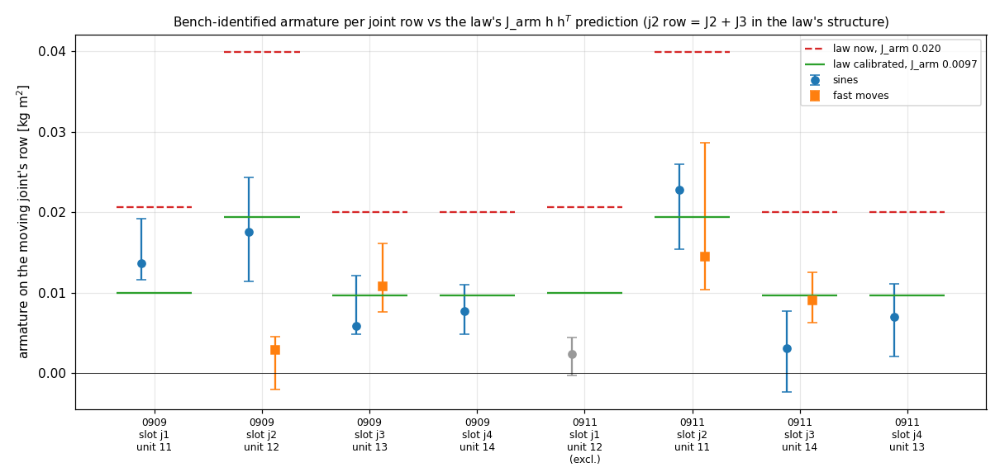

# The law's `J_arm`, calibrated from the ground-bench bags only (2026-09-26)

**Result: `J_arm` = 0.0097 kg·m² (band 0.0077–0.0120), against the 0.0200 the law carries now.**
The fit keeps the law's own structure: `J_arm·h hᵀ` on every arm link, as in `controller.make_params:236-239`
and `wb_model.cpp:135-140`. With 0.0097, that model reproduces the measured total inertia on every trusted joint row.
With 0.0200 it over-predicts every row by about 2×.

- **Data used:** only the bench bags in `docs/experimental_data_ros2_bag/2026-09-09 (ID 12 & 13) …` and
  `2026-09-11 (ID 11 & 14) …`.
- **Data not used:** no flight data.
- **Controller:** nothing in the controller was changed.



## Units, slots, flight joints

The armature belongs to a servo unit. The unit numbers below are the IDs the units carried before the swap.

| | slot j1 | slot j2 | slot j3 | slot j4 |
|---|---|---|---|---|
| session 09-09 | 11 | **12** | **13** | 14 |
| session 09-11 | 12 | **11** | **14** | 13 |
| FLIGHT (= 09-11) | J1 = 12 | J2 = 11 | J3 = 14 | J4 = 13 |

Every unit was measured in two slots, and one of those is always a gravity-loaded middle slot.

## What a single moving joint measures

On a fixed base with one joint moving, that joint's own row is `(M_jj + J_row)·q̈ + g + friction`. `M_jj` is constant through the motion, and the row has no Coriolis term.

- **The total `M_jj + J_row` is measured model-free.**
- **The link part** `M_jj` comes from the whole-body model with the armature removed. It agrees with the URDF (pinocchio, `custom_inv.urdf`) to 1–2% at every test pose, and gravity agrees to 0.2%.

In the law's structure, `J_row` is not one unit's armature:

| row | armature seen by the law | why |
|---|---|---|
| j1 | J1 + cos²(q2+q3)·J4 | (0.03·J4 at home) |
| j2 | **J2 + J3** | link 3's `h hᵀ` also spins about the parallel j2 axis |
| j3 | J3 | |
| j4 | J4 | |

`calib_jarm.unit_columns()` computes these coefficients from the model at each test pose.

## The measurement problem, and how it was handled

**Friction dominates.** The gear friction is 0.07–0.28 N·m. The inertial torque at the bench accelerations (0.14–0.58 rad/s² in the sines) is 1–3 current counts, and on j4 less than one. Three things were learned the hard way:

1. **Whole-cycle two-frequency harmonics fail** (`ident_bench.py`, first pass).
   - The stick at every reversal leaks into the in-phase component differently at the two speeds.
   - Result: 15× disagreement between the two slots of the same unit.
2. **Kinetic-plateau two-frequency fit: the primary sine estimator** (`ident_plateau.py`).
   - Only the sliding part of each half-cycle is used.
   - Per window: friction `a + F·sgn + b·q̇ + s·sgn·(q−c)` (the last term is the load-dependent friction).
   - A stiffness `K(q−c)` is shared by windows at the same pose AND amplitude. `J` comes only from exciting that group at both 0.133 and 0.266 Hz, since inertia scales with ω² and any rate-independent stiffness does not.
   - Amplitude matching is required. The per-rad tilt at ±5.5° differs from ±11° at the same frequency, so those groups carry no J information.
   - The 76-min `coupling_j1j3` bag also recorded the eval runs, so those windows are de-duplicated by absolute time.
3. **Fast repositioning moves: the independent check** (`calib_jarm_v2.py`).
   - These are 20–25° min-jerk moves at 25–30 °/s. Their |q̈| of about 1 rad/s² is 2–5× the sines.
   - Two corrections are essential:
     - **(a) Onset transient.** Samples within 3–7° of motion onset are excluded, because gear friction is high after a start and decays over ~5° (see `plateau_shapes.png`).
     - **(b) Gearbox friction law.** The calibration report's `µ|S·g + M_links·q̈|` term is removed, with µ = 0.246 / 0.161. Without it, j3's 0.14 N·m gravity change across a move correlates with the min-jerk acceleration and inflates J by ~0.008.
   - With both corrections, the j3-row moves (0.009–0.011) agree with the j3-row sines.
   - The j2 moves are all *lowering* against 0.6 N·m of gravity. They stay unreliable (0.00–0.03) and are **not** fitted.
4. **Lever sweeps are useless for J** (`calib_lever.py`, negative result). Over a 72–108° sweep the gravity-model error is collinear with the 0.3 rad/s² min-jerk acceleration, and J swings by ±0.2 with the gravity-polynomial degree.

**Excluded row:** 09-11 slot j1 (unit 12). Its joint-1 mounting screws were loose until the "joint1 resolution" just before `eval_final` (bag README). Every usable j1 window of that session is before the fix or ambiguous. It reads 0.002, and it is shown grey in the figure.

## Numbers (`results.txt`)

`J_row` = the armature on each moving joint's row, median [min..max] over method variants. The sine variants are kinetic threshold 0.3/0.5/0.7/0.8 × current delay 0/8 ms. The move variants are onset exclusion 3/5/7° × µ 0.7/1.0/1.3.

| session, slot (unit) | sines | fast moves | law now (0.020) | law calibrated (0.0097) |
|---|---|---|---|---|
| 09-09 j1 (11) | 0.0136 [0.0116..0.0192] | — | 0.0206 | 0.0100 |
| 09-09 j2 (12) | 0.0176 [0.0114..0.0243] | 0.0029 (lowering — unreliable) | 0.0400 | 0.0194 |
| 09-09 j3 (13) | 0.0059 [0.0048..0.0121] | 0.0108 [0.0076..0.0161] | 0.0200 | 0.0097 |
| 09-09 j4 (14) | 0.0077 [0.0048..0.0110] | — | 0.0200 | 0.0097 |
| 09-11 j1 (12) | 0.0023 — **excluded** | — | 0.0206 | 0.0100 |
| 09-11 j2 (11) | 0.0228 [0.0154..0.0260] | 0.0145 (lowering — unreliable) | 0.0400 | 0.0194 |
| 09-11 j3 (14) | 0.0031 [-0.0023..0.0077] | 0.0091 [0.0062..0.0125] | 0.0200 | 0.0097 |
| 09-11 j4 (13) | 0.0070 [0.0020..0.0110] | — | 0.0200 | 0.0097 |

Weighted fits, sines + j3-row moves, over 72 variants:

| model | one scalar | per unit, in flight order J1..J4 (units 12, 11, 14, 13) | χ²/dof |
|---|---|---|---|
| **`h hᵀ` (the law)** | **0.0097 [0.0077..0.0120]** | 0.0086, 0.0136, 0.0084, 0.0090 | 15.1/8 (scalar), 8.1/5 |
| joint-diagonal | 0.0108 [0.0085..0.0136] | 0.0176, 0.0162, 0.0085, 0.0090 | 26.6/8 (scalar), 9.0/5 |

Per-unit bands: unit 11 [0.010..0.017], unit 12 [0.004..0.015], unit 13 [0.005..0.012], unit 14 [0.004..0.012]. The unit-to-unit differences sit inside the bands, so **one scalar is what the data support**. That is also what the law has.

**Structure.** The law's `h hᵀ` fits better than a joint-diagonal armature, because the j2-row sines read about twice the j3/j4 rows. The j2-row fast moves read the opposite way, but they are lowering-only and gravity-dominated. **These bench data therefore lean toward the law's structure but cannot settle it.** The physical argument for a diagonal structure (the rotor turns at N·q̇ relative to its own housing) still stands.

**Cross-check, not used in the fit:** the 0924 flight-4 fit in the `h hᵀ` form gave J = 0.011 (`../README.md` §2), which matches the bench value.

## What 0.0200 → 0.0097 does to the law

Held structure `h hᵀ`; floating base; K_y 20, M_y 1/1/1/0.05, DLS 0.3. Pose [0, 40, 40, 0]:

| | J_arm 0.0200 | J_arm 0.0097 |
|---|---|---|
| M̃_ρ diag | 0.031 / 0.051 / 0.026 / 0.020 | 0.020 / 0.031 / 0.015 / 0.010 |
| M̃_ρ j2/j3 eig | 0.0105 / 0.0664 | 0.0066 / 0.0394 |
| Kq j2/j3 eig [N·m/rad] | 0.21 / 1.31 | 0.13 / 0.78 |
| M_r diag | 0.078 / 0.091 / 0.083 | 0.077 / 0.090 / 0.083 (unchanged) |
| N1 x-row (j2, j3) | 1.11, −0.21 | 1.17, −0.33 |

Read this both ways:

- **The static stiffness drops ~40%.** Kq = ω²·M̃_ρ scales with the model inertia, so at the same K_y the joints get softer.
- **The design bandwidth becomes true.** The law has been assuming about twice the real arm inertia, so its arm loop ran about √2 faster than designed. Correcting `J_arm` restores the designed bandwidth and lowers stiffness.
- **Retune with it.** Any J_arm change should come with the arm-gain retune in `../README.md` §3.
- **The offline stiffness sim needs a re-run.** Its "J_true ≳ 0.02" indirect bound assumed a diagonal plant armature. Re-run it with the bench rows before relying on that bound.

Applying the value means touching four places:

- `controller.make_params` (Python)
- `wb_model.cpp` (C++)
- the parity fixtures
- the `fsc_trajectory_planner` rebuild, since it links `wb_law`

Not done here.

## Reproduce

```bash
source /opt/ros/humble/setup.bash; source ~/ros2_ws/rosdeps/local_setup.bash
cd tools
PYTHONNOUSERSITE=1 /usr/bin/python3 extract_bench.py '^eval_' '^coupling'            # 19 bags -> ../data
PYTHONNOUSERSITE=1 /usr/bin/python3 extract_bench.py '^collect_kt_(L2|L2X|L2XX|L2E|L3f|L3fB)_empty(_w[+-]85|_close)?$'
PYTHONNOUSERSITE=1 /usr/bin/python3 final_jarm.py             # results.txt + jarm_bench.png (builds ../prepared_fc2.npy, ~3 min)
# diagnostics: ident_plateau.py [fc vfrac delay_ms], calib_jarm.py scan, calib_jarm_v2.py, calib_lever.py
```

**Cache trap:** `ident_bench.prepare_all()` caches `../prepared_fc<fc>.npy` and does not notice new npz files. Delete the cache after extracting more bags.

## What would pin it down properly

The inertial signal here is at the current sensor's noise floor. A dedicated run would pin it down:

- **Excitation:** each joint one at a time, a multisine of 0.3–2 Hz at ≥ 3 frequencies, amplitude large enough to keep sliding (±15°), acceleration ≥ 2 rad/s².
- **Loads:** empty and 200 g.
- **Why:** it would lift the signal ~5× above the friction-shape noise and give the ≥ 3 frequencies that `utils_calibration/README.md` "K1 by differential inertia" asks for.
- **Order:** j1 and j4 first. They carry no gravity, so they are the cleanest channels for J itself.

## Does the overestimate explain the flights? Will the calibrated value help? (`tools/sim_bench_plant.py`)

We tested this in the offline arm sim `../arm_stiffness_sim.py`, with the arm (plant) set to the bench values instead of the 0.020 guess. The sim runs the exact law, the 4-D hardware config, stick-slip friction, the 48 ms / 0.024 rad/s Present Velocity, and flight 3's arm design. Two plants were used, both matching every measured row total:

- **uncoupled:** joint-diagonal `[0.010, 0.0194, 0.0097, 0.0097]`
- **coupled:** `h hᵀ` 0.0097

Hardware flight 3 reads j2/j3 5.0/8.3° rms, overshoot 7–12°, stuck 20–57%.

| law | uncoupled bench arm: j2/j3 rms, overshoot, stuck | coupled bench arm |
|---|---|---|
| flown: `h hᵀ` 0.020, K_y 20/12 | **5.6/8.9°, +6.9/+11.3°, 23/35 %** | aborts 20.9 s |
| `h hᵀ` 0.0097, K_y 20/12 (change J_arm only) | 9.0/14.8° | 8.3/13.7° |
| `h hᵀ` 0.0097, K_y 33/20 (= flown joint gains) | 6.1/9.6° | aborts 5.7 s |
| `h hᵀ` 0.0097, K_y 50/20 | 4.3/6.7° | unstable (tilt 30°) |
| `h hᵀ` 0.0097, K_y 100/28 | limit cycle | unstable |
| joint-diagonal bench values, K_y 20/12 | 3.1/7.1° | 2.9/5.5° |
| joint-diagonal bench values, K_y 50/20 | **1.3/3.0°** | **1.8/3.0°** |

What this shows:

- **The bench-measured arm is consistent with the flights.** With the uncoupled arm, the flown law reproduces flight 3 with no tuning. This supersedes `../README.md`'s "J_true ≳ 0.02" inference, which assumed equal armature on every joint.
- **The overestimate made the arm stiffer, not softer.** `Kq = ω²·M̃_ρ` scales with the model inertia. On the real arm, the flown law ran at 0.9 Hz, ζ 1.7, against its K_y 20/12 design of 0.71 Hz, ζ 1.34. The joint-stiffness deficit the flights showed is friction against `Kq`, and the correct `J_arm` would have made it worse.
- **Changing only the VALUE does not improve tracking.**
  - At the same K_y, the joints soften ~40% (0.20/1.35 → 0.125/0.82 N·m/rad), so the errors grow ~1.6×.
  - At K_y ×1.65 the law is identical in joint space to what flew.
  - Raising gains in the `h hᵀ` structure hits the Present-Velocity limit early, and on the coupled plant it is fragile.
- **What does improve tracking is the STRUCTURE.** The same bench values placed joint-diagonally give j2/j3 stiffness 0.27/0.68 N·m/rad (2.5:1) instead of `h hᵀ`'s 6.6:1 soft direction. That tracks 1.8–2× better at the same K_y, and ~4× better at K_y 50/20. It is stable on BOTH plant structures, so it does not depend on the unresolved structure question.
- The corresponding hook is `controller.dynamics`' `armature_diag`, which is Python-only. `wb_model.cpp` has no equivalent yet.
- **Caveats:** this is one offline sim, validated against one flight, and the answer still needs a hardware A/B.

## Can J_arm be TUNED (inflated) for stiffness? (same sim, `sim_bench_plant.py J<v>` / `K<ky>_<dy>`)

Inflating `J_arm` in the `h hᵀ` structure scales the joint stiffness Kq AND the joint damping Dq by the same factor, because both are model inertia × task gain. The 6.6:1 anisotropy does not change. So a tuned `J_arm` is joint-space-equivalent to the calibrated value with K_y and D_y scaled together:

| `J_arm` | joint-space factor vs 0.0097 | equivalent K_y / D_y |
|---|---|---|
| 0.015 | ×1.33 | 26.4/15.8 |
| 0.020 | ×1.64 | 33/20 |
| 0.030 | ×2.25 | 45/27 |
| 0.040 | ×2.87 | 57/34 |
| 0.060 | ×4.1 | 82/49 |

j2/j3 rms, flight 3's arm design, bench-measured arm:

| | uncoupled arm | coupled arm |
|---|---|---|
| `J_arm` 0.015 / K 26.4_15.8 | 6.8/11.1° / 7.0/11.6° | 6.8/11.0° / 7.0/11.3° |
| `J_arm` 0.020 (flown) / K 33_20 | 5.6/8.9° / 6.1/9.6° | abort / abort |
| `J_arm` 0.030 / K 45_27 | abort / limit cycle | abort / limit cycle |
| `J_arm` 0.040 / K 57_34 | limit cycle / limit cycle | abort / limit cycle |
| `J_arm` 0.060 / K 82_49 | abort / limit cycle | abort / abort |
| for contrast: 0.0097, K 50_**20** | 4.3/6.7° | unstable |

What this shows:

- **The two routes behave the same.**
- **The flown 0.020 already sits at the stability edge.** Above it, every case limit-cycles or aborts. This is the arm loop going unstable first: velocities exceed 1000 °/s and torques hit the servo caps.
- **What binds is the DAMPING on the 48 ms-late Present Velocity, not the stiffness.** K 50/**20** (stiffness ×2.5, damping held at ×1.64) is stable and better; K 45/27 is not.
- **Tuning `J_arm` cannot separate stiffness from damping.** It also shifts the base-side terms (N1 arm-reaction feedforward: j3 entry −0.33 → −0.08 over the sweep; M_r; Λ_y; reference feedforward; observer momentum) away from the real arm.
- **Conclusion: keep `J_arm` at the calibrated value.** Take stiffness from K_y with D_y held. Take the rest from the joint-diagonal structure (anisotropy) and from a faster velocity signal (the damping ceiling, `../README.md` §3).

## ADOPTED (2026-09-26, user's direction) and flown in Isaac

Order fixed by the user: (1) armature structure, (2) observer velocity, then (3) gains.

| change | where |
|---|---|
| Armature on the joint DIAGONAL, bench values [0.010, 0.0194, 0.0097, 0.0097] | `wb_model.{hpp,cpp}` (`useJointDiagonalArmature`, `armature_diag` terms — the port of `controller.dynamics`' hook), `transition_planner.make_params_t650(armature_diag=)`, `fsc_trajectory_planner` vehicle options + node params; yaml keys `wb_armature_joint_diag / wb_armature_j1..j4`, planner `armature_joint_diag / armature`; 06 `PEGASUS_ARM_ARMATURE` ← yaml `sim_arm_armature_j1..j4` |
| Parity | `generate_wb_truth.py --armature-diag` → `wb_truth_t650_jointdiag.json`; `WbParityJointDiagTest` 4/4 at 1e-8; original suite untouched, 14/14 whole-body tests |
| M_r_d rescaled with M_r (×1.122 / 0.999 / 1.073) | 0.130710 / 0.135962 / 0.134261 — attitude loop unchanged |
| The law's q̇ = the arm's `~/velocity_observer` (12 ms) | keys `wb_arm_velocity_topic`, `wb_arm_velocity_timeout_s` 0.05; fallback WARN + `wb_control_debug[106..114]`; gate refusal; Isaac arm yaml now publishes the observer |
| K_y / D_y 20/12 → 80/24 | both 4-D yamls; sweep in `tune/README.md` |

**Isaac A/B**, mirror plant, F3 circle (`sim2real_tuning_20260926/tools/replay.sh a3`, RTF 0.48; `tools/law_ab_yaml.py old|new` swaps the law, plant identical):

| circle leg | hardware F3 | sim, flown law | sim, new law |
|---|---|---|---|
| q2 / q3 rms | 5.03 / 8.28° | 2.29 / 4.85° | **1.07 / 1.39°** |
| EE rms | 12.3 mm | 20.8 mm | **10.3 mm** |
| CoM rms / \|e_R\| | 44 mm / 0.036 | 97 / 0.106 | 94 / 0.104 (unchanged by design) |
| sat / clamp | 0 / 0 | 0 / 0 | 0 / 0 |

Observer on 100 % of DIRECT ticks, 0 fallbacks. The sim arm is optimistic vs hardware
(old law: 2.3/4.9 sim vs 5.0/8.3 flown), so expect less than 2–3.5× on hardware. RTF
caveat and the planner integer trap: `tune/README.md` §3. The 6-D, GMO and
`_sim_robustness` yamls keep the old law. NOT flown on hardware; nothing committed.
