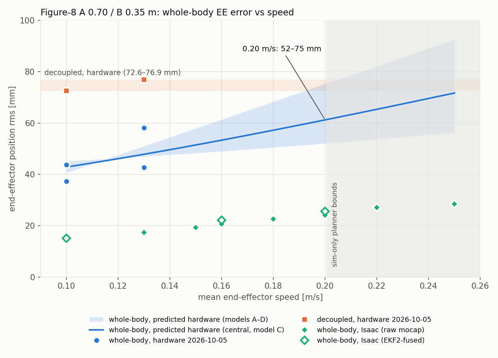

# Whole-body figure-8 speed sweep, and the hardware speed it supports (2026-10-07)

Question (user): fly the whole-body 4-D L1 controller faster on the figure-8 -- 0.16 or 0.20 m/s --
in simulation first; pick a SAFE mean speed at which its HARDWARE EE rms is about the decoupled
controller's hardware rms on the same figure-8 (72.6 / 76.9 mm at 0.10 / 0.13 m/s, 2026-10-05).

**Answer: 0.20 m/s.** Predicted hardware EE rms 52–75 mm (central 61), at or below the decoupled
72.6–76.9 mm. It is also the fastest this shape can plan under the hardware yaml's bounds. No
safety margin is close to its limit. Suggested order: 0.16 m/s first (predicted 49–61 mm), then
0.20 m/s.



## Setup

The hardware's first-flight shape: A 0.70 / B 0.35 m, path 4.268 m, q2 = 25 ± 15° at lap/4,
fold 55°, 1 lap, s = 1, long axis on world x. The 10-05 sweep's launch condition: Isaac headless
at RTF 1 (every 10 s window read 1.000 in every flight), mirror plant, takeoff yaw 45°. EE-run
planner bounds = the hardware yaml's: a 0.40 m/s², yaw 1.0 rad/s, CoM speed the shared 0.30 m/s.
The 0.22 / 0.25 m/s probes raise them in sim only. The flown law, yaml and plant equal the 10-05
sweep's (the mirror yaml differs only in pick-and-place keys; the client's uncommitted change is
two default-off options), so its A 0.70 whole-body flights are pooled.

`run_speed.sh <v>:<tag> ...`, batches `run_batch1/2/3.sh`. `AM_CMP_FEEDBACK=fused` flies the
EKF2-fused twin pair, the hardware's feedback path. It is a new default-off switch in
`application/robotic_arm/utils/am_compare_cycle.sh`.

## Isaac results (all completed runs, RTF 1, 0 rotor saturation, 0 joint clamp)

| v [m/s] | runs | EE rms [mm] (raw · fused) | EE peak | tilt max [deg] | s_max | rotor cmd | yaw use p99 | τ_j2 max [N·m] |
|---|---|---|---|---|---|---|---|---|
| 0.10 | 2 raw + 1 fused | 14.3 / 14.5 · 15.1 | 31 | 2.2 | 2.02 | 0.46–0.76 | 33 % | 1.05 |
| 0.13 | 1 | 17.4 | 38 | 2.2 | 1.56 | 0.44–0.78 | 38 % | 1.36 |
| 0.15 | 1 (10-05) | 19.4 | 37 | 2.4 | 1.36 | 0.41–0.79 | 42 % | 0.99 |
| 0.16 | 2 + 1 fused | 20.6 / 20.6 · 22.1 | 42 | 2.5 | 1.26 | 0.41–0.79 | 44 % | 1.08 |
| 0.18 | 2 | 22.3 / 22.5 | 48 | 2.5 | 1.13 | 0.38–0.81 | 48 % | 1.07 |
| **0.20** | **2 + 1 fused** | **24.1 / 24.3 · 25.6** | **52** | **2.6** | **1.02** | **0.36–0.82** | **52 %** | **1.02** |
| 0.22 (sim bounds) | 1 | 27.1 | 54 | 3.0 | 1.06 | 0.35–0.82 | 58 % | 1.03 |
| 0.25 (sim bounds) | 1 | 28.4 | 55 | 3.2 | 1.08 | 0.31–0.85 | 63 % | 0.95 |

Peak, tilt and actuator columns are the raw-mocap runs' worst; the fused runs peak at 34 / 43 / 49 mm with rotor commands 0.36–0.82. The sim error is linear in speed (fit 4.6 + 98.6·v mm), and repeats agree to 0.2 mm. The fused
feedback adds ~1 mm at the same slope, so EKF2 does not explain the hardware gap.

Two flights tripped the guard while HOVERING in DIRECT, before any trajectory: `wb_v013_b`, and
`wb_v025_a_hovertrip`, kept under that name. Both were the known 1.50 Hz sim pitch mode (e_R,y
peak-to-peak 0.11 → 0.49 over 15 s). That makes 2 of 14 today; 10-05 had 2 of 10. The mode is
sim-only: the 1.3–1.7 Hz band holds 23–47 % of the sim's e_R,y energy but 7–9 % on hardware (245 s
of 10-05 DIRECT, broadband, no peak). One more cycle stalled at arm bring-up: its arm stack
streamed near-zero torques, and the arm sagged to q2 −11.5°. It was killed before flying and
re-flown.

## From Isaac to hardware (`tools/predict.py`, `analysis/prediction.json`)

The hardware error is mostly NOT what the sim models. Each 10-05 speed pair splits into a part
that repeats between the two runs and a part that does not (`tools/hw_decompose.py`):

| v | runs [mm] | repeatable | random | Isaac |
|---|---|---|---|---|
| 0.10 | 37.3 / 43.7 | 18.8 | 36.0 | 14.4 |
| 0.13 | 42.7 / 58.2 | 23.4 | 45.3 | 17.4 |

The repeatable part is 1.3× the Isaac error. The random part is the airframe wander (power mostly
at 0.06–0.3 Hz), and it is already 24–39 mm in the static DIRECT holds (`tools/hw_holds.py`).
That is why the whole-body real/sim ratio on this figure-8 is 2.9, not the ~1.7 (= 1/0.6) used
until now: the 10-05 envelope's "/0.6" predicts 24 mm at 0.10 against 40.6 flown. The decoupled
ratio is 1.6 (Isaac 44 → 73 mm).

The sim's error does not repeat the hardware's TIME PATTERN (`tools/pattern_check.py`: along-path
correlation +0.01 at 0.10, −0.70 at 0.13, no lag fixes it). So the scaling is by magnitude only.
Four models bracket the speed dependence; all reproduce the flown speeds:

| model | form | 0.16 | 0.18 | **0.20** | 0.22 | parity with decoupled |
|---|---|---|---|---|---|---|
| A proportional | hw = 2.88 · sim | 59 | 64 | **70** | 76 | 0.21–0.22 m/s |
| B constant wander | √((1.32 sim)² + 40.9²) | 49 | 51 | **52** | 54 | never (> 0.35) |
| C wander grows | √((1.32 sim)² + 32.5² + (204 v)²) | 53 | 57 | **61** | 65 | 0.25–0.27 m/s |
| D linear in v | 6.0 + 346 v | 61 | 68 | **75** | 82 | 0.19–0.21 m/s |

Between the 10-05 pairs a single run differs by up to ±8 mm from its pair's mean (0.13: 42.7 vs
58.2), so expect one 0.20 m/s run anywhere in ~50–85 mm.

## Safety at 0.20 m/s on hardware

| item | 10-05 hardware (0.10 / 0.13) | Isaac 0.20 | projected hardware 0.20 | limit |
|---|---|---|---|---|
| tilt | 2.2 / 2.2–2.3° (= Isaac at those speeds) | 2.6° | ~2.6–3° | watchdog 15° |
| rotor command | 0.28–0.84 | 0.36–0.82 | ~0.21–0.87 | 0..1 |
| yaw torque \|τz\| | p99 0.31–0.33, max 0.36–0.41 | p99 0.36 | p99 0.33–0.37, max 0.42–0.46 | budget ≥ 0.62 N·m |
| j1 / j2 / j3 torque | 0.10–0.11 p99 / 1.15–1.26 / 0.54–0.58 | 0.08 / 1.02 / 0.47 | unchanged (j1 is noise: R² 0.01–0.06 vs yaw motion) | 0.34 / 2.44 / 1.42 |
| CoM error peak | 89–153 mm | 52 mm | ~140–200 mm | drift guard 0.75 m |
| footprint | planned 1.62 × 0.89 m; measured overshoot ≤ 23 mm/side | same box | planned 1.62 × 0.90 m + a few cm | flight area |

Yaw (`tools/yaw_authority.py`): the hardware's larger yaw command is a standing +0.15–0.17 N·m bias
plus 0.05 N·m of noise. Its speed-dependent part is no larger than Isaac's, so the projection
replays the 0.20 m/s plan through the four hardware fits. Rotor commands are rebuilt through the
hardware allocator (`tools/margins.py`), which matches the logged motors_debug to 0.002–0.004. The
hardware's peak errors fall inside the 8, and at the lobe ends it cuts the corner inward
(`tools/hw_footprint.py`).

**What limits the speed is the planner, not the controller.** At 0.20 m/s s_max = 1.02: CoM speed
0.294 of 0.30 m/s, yaw rate 55 of 57°/s, acceleration 0.37 of 0.40 m/s². A hover pose that plans
slightly slower makes the GS run at s_max (~0.196 m/s). Going faster means raising the hardware
yaml's EE-run bounds. The sim flew 0.22 and 0.25 m/s cleanly with them raised, but that is a
separate step.

Suggested go/no-go after a 0.16 m/s run: EE rms ≤ ~65 mm (band 49–61 + scatter), tilt ≤ 5°,
rotor commands inside ~0.15–0.92, no watchdog. If 0.16 lands above ~70 mm, the extrapolation is
wrong; stay there.

## Reproduce

```bash
./run_speed.sh 0.20:v020_c                         # one flight (headless, RTF 1)
AM_CMP_FEEDBACK=fused ./run_speed.sh 0.20:v020_g   # the EKF2-fused feedback path
# hardware bags -> npz (see ../wb_vs_decoupled_figure8_flight_20261005/README.md step 1), then:
AM_NPZ=<dir> PYTHONNOUSERSITE=1 /usr/bin/python3 tools/hw_decompose.py --json analysis/hw_decompose.json
AM_NPZ=<dir> PYTHONNOUSERSITE=1 /usr/bin/python3 tools/hw_holds.py
AM_NPZ=<dir> PYTHONNOUSERSITE=1 /usr/bin/python3 tools/margins.py hw w3 w4 w5 w6 --json analysis/margins_hw.json
AM_NPZ=<dir> PYTHONNOUSERSITE=1 /usr/bin/python3 tools/yaw_authority.py hw w3 w4 w5 w6 --json analysis/yaw_hwfit.json
/usr/bin/python3 tools/predict.py --json analysis/prediction.json      # numpy 2 (the pickled sim debug array)
/usr/bin/python3 tools/margins.py sim data/wb_v020_b.npz
PYTHONNOUSERSITE=1 /usr/bin/python3 tools/plot_prediction.py           # numpy 1 matplotlib
```
