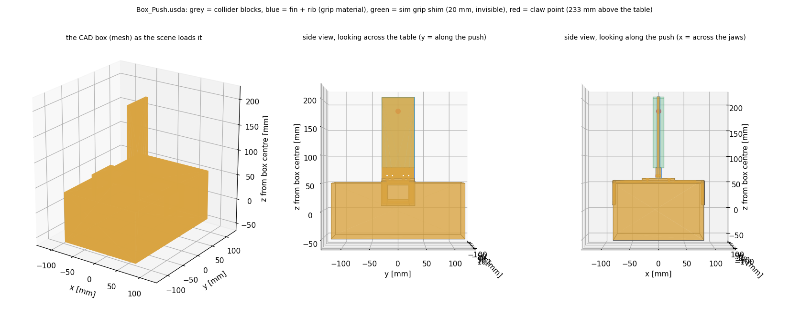

# Push and pull with the CAD box (2026-10-07)

User request: "This is the CAD model for our box with the handle for push and
pull task ... The total weight can be 400g. You can use it to generate a usda
file for this box, like what we did to the pick-and-place task today. Then you
can use it to do the push and pull simulation, to see if it works."

Earlier push-and-pull work: `../push_pull_20261003/README.md` (sections 7–9.2).
Commands: Command.md section 17.

## 1. The CAD (`rotorcraft/assets/Box_Push.stl`)

Binary STL, **metres, +Z up**, 8880 triangles, two parts:

| part | what it is (measured from the mesh) |
|---|---|
| box (12 triangles) | a closed cuboid **240 × 160 × 100 mm** (CAD x × y × z) — 5 mm taller than the 95 mm measured on 10-06 |
| clamp bracket (8868 triangles) | two framed **side plates** (4 mm, 60 wide, a 40 × 30 mm window) hanging 40 mm down the box's 160 mm faces; a 4 mm **strip** across the top joining them (168 × 60 mm); a 60 × 60 × 4 mm **screw pad** (8 holes); a 10 mm **rib** (60 long, to 128 mm above the table); and a **fin 60 mm long × 5 mm thick**, seated in a slot in the rib, from 75 to **258 mm above the table** (bare above the rib, 128..258) |

Every bracket piece is an axis-aligned block. The fin is on the box's top
centre, its 60 mm along the box's 240 mm axis (the push direction) and its 5 mm
across: the jaws close across the 5 mm — the orientation of the 10-06 post, but
much thinner.

## 2. The asset (`tools/stl_to_usda_push.py` → `rotorcraft/assets/Box_Push.usda`)

    cd tools && /usr/bin/python3 stl_to_usda_push.py      # usd-core is in the user site: NOT PYTHONNOUSERSITE=1

- **Frame** = the scene's box frame: origin = box centre (= mocap `obj_0`), +z up,
  **+y = the 240 mm axis = along the fin = the push**, +x = the 160 mm axis
  (across the fin; the jaws close along it). Rz(+90) of the CAD frame.
- **Visual**: the full STL mesh, welded.
- **Colliders**: the box + the bracket as **13 exact convex blocks** read off the
  CAD's faces (side-plate frame bars, strip, pad, rib, fin); the converter
  REFUSES to write unless every bracket vertex lies in its blocks. The screw holes,
  the pad pocket and the rib's pin hole are left solid (nothing touches them).
  The fin and rib carry `fsc:grip = true` (the scene binds the grip material to them).
- **Mass**: 400 g, centre of mass and inertia of the CAD solid at **uniform
  density**. The bracket is 101 cm³ of 3941 (2.6 %), so it gets ~10 g and the CoM
  sits 2.2 mm above the box centre (52 mm above the table). `--handle-mass`
  gives the printed bracket its own mass if you weigh it.
- `fsc:*` attributes carry the box size and fin geometry for the scene.

`tools/plot_asset.py` (two passes: `--dump` with the user site, then the plot
with `PYTHONNOUSERSITE=1`).

## 3. The scene (`07_px4_direct_t650_aerial_manipulator_push_and_pull.py`)

- `PEGASUS_PUSH_HANDLE=cad` is the **new default** (`post` / `fin` keep the old
  handles). The box body is the unscaled Xform at the box centre, the asset
  REFERENCED onto it; box size and EE offset are read from the asset.
- **THE GRIP SHIM.** The sim claw cannot clamp 5 mm: the asset's slider-crank
  stops the pads ~19 mm apart (~14 mm at the fingertips; measured in the
  pick-and-place campaign the same day), while the real gripper's foam pads close
  fully. So the fin's bare part (128..258 mm above the table) gets an **invisible
  collider `PEGASUS_PUSH_FIN_GRIP_MM` wide (default 20)** — the clamped width
  that flew 10-04..10-06 — standing in for the foam the sim claw lacks.
  `PEGASUS_PUSH_FIN_GRIP_MM=0` gives the bare CAD fin (the jaws close on air).
- The grasp point: 25 mm under the fin top = **233 mm above the table** →
  planner `push_pull_ee_offset: [0, 0, 0.183]` (the generated push yaml,
  `make_push_pull_yaml.py`; was 0.2255 for the post). Tipping
  μh / (L/2) = 0.29 × 0.233 / 0.12 = 0.56.
- Gear clearance at the grasp (planner model, T650 gear 0.2425 m): 50° pose
  [0, 26, 24, 0] → skids 62 mm above the box top; 70° pose [0, 30, 40, 0] → 5 mm
  BELOW it, but the skids sit 0.14 m to each side, outside the 168 mm bracket
  and 9.5 cm above the table.

## 4. Flights

Headless, RTF 1, RAW mocap feedback, the push yaml (`WB_SIM_PROFILE=push_pull`)
with the arm pose, `wb_l1_omega_c_t` 1.0 and the other changes set per run,
400 g, μ 0.29 / 0.29, the real arm's q2 range [−20, 45] as hard stops, T650
gear. A pull starts the box at y = −0.25 (`PEGASUS_PUSH_BOX_XY="1.20,-0.25"`)
with `push_pull_push_distance: -0.50`. One run = `tools/try_cad.sh <tag>
key=val ...` (it regenerates the yaml, flies `push_pull_20261003/tools/run_pl.sh`
and restores the yaml); the chains are `tools/chain_1..6.sh`. Score:
`PYTHONNOUSERSITE=1 /usr/bin/python3 tools/summarize.py`.

| run | task | arm pose (deg) | change | outcome | box moved (mm) | slide e_imp (N) | ρ_UAV | q2 range | q3 range | tilt max |
|---|---|---|---|---|---|---|---|---|---|---|
| cad_01 | push | [0, 26, 24, 0] (50°) | – | **complete** | 500 | 1.25 | 0.099 | 14.1..39.7 | 8.6..37.7 | 3.1 |
| cad_03 | push | 50° | – | **complete** | 496 | 1.23 | 0.070 | 17.6..44.5 | 1.0..35.4 | 2.9 |
| cad_06 | push | [0, 26, 34, 0] (60°) | – | **complete** | 498 | 1.20 | 0.090 | 17.0..36.2 | 25.7..43.9 | 2.6 |
| cad_02 | pull | 50° | – | failed 8.2 s in | 282 | – | – | 7.1..45.0 | 2.7..40.2 | 6.8 |
| cad_04 | pull | 50° | – | failed 9.5 s in | 402 | – | – | 12.5..45.0 | −8.8..35.5 | 7.2 |
| cad_05 | pull | 60° | – | failed 6.4 s in | 119 | – | – | 18.4..40.7 | 13.8..41.0 | 6.1 |
| cad_08 | pull | 60° | `wb_dy` 26.8 → 40 | unstable in FREE flight (Ready) | – | – | – | – | – | 58 |
| cad_09 | pull | 60° | `wb_k_x/k_v` 50/12.6 → 32/20 | unstable in HOVER (8 s after DIRECT) | – | – | – | – | – | 44 |
| cad_07 | pull | 60° | **pull 12 → 24 s** | **complete** | 491 | 1.09 | 0.064 | 18.3..42.2 | 13.2..40.7 | 6.0 |
| cad_10 | pull | 60° | pull 24 s | **complete** | 497 | 1.34 | 0.074 | 12.0..41.9 | 13.4..44.1 | 5.8 |
| cad_11 | pull | 60° | pull 24 s + CONTACT on until the jaws open | **complete** | 495 | 1.28 | 0.065 | 14.2..40.2 | 17.6..41.9 | 6.4 |
| cad_12 | pull | 60° | pull 24 s | **complete** | 498 | 1.08 | 0.046 | 14.8..32.6 | 22.3..44.8 | 4.5 |

(Box travel, joint ranges and tilt from the push start to its end, or to the
failure: the planner's guard abort or tilt > 8°, whichever is first.
2026-10-06's post handle, same settings: push 2/2, pull 0/6.)

### 4.1 Push

The fin plus the 20 mm shim is gripped like the post, the box slides the full
0.50 m and stays on the table, and the numbers sit on 10-06's (1.04 N /
ρ 0.085 there). The margin is thin at the 50° fold: q3 reached 1.0° (cad_03)
when the box broke loose and the base lagged 25 mm, which the world-held claw
turns into arm extension. The **60° fold [0, 26, 34, 0]** (cad_06, one run)
pushed as well with the joints well inside their range (q2 ≤ 36.2,
q3 25.7..43.9) — the better push pose, worth a repeat.

### 4.2 Pull at the planned 12 s: 0/3

- **The grip holds**: the box moves with the claw to 2–5 mm, push and pull alike.
- **The arm is not the cause**: q2/q3 swing ±6–7° (std), counter-phased, at
  0.3–1 Hz in EVERY run, push and pull, from the start — the base moves ±1–2 cm
  along the arm and the world-held claw absorbs it (4–5.5° of q2 per cm,
  `push_pull_20261003/README.md` 9.2). At 60° (cad_05) the joints stayed in
  range until the very end.
- **The average lean is right**: measured from the hover pitch (−0.4..−1.4°),
  the drone leans by what the horizontal contact force needs, 1–2.5°, in
  push and pull alike.
- **What differs is the box's stick-slip and how big the swing grows.** The box
  sticks, lags its plan by 13–20 mm, then lurches toward the vehicle at
  0.13–0.26 m/s against a planned 0.08–0.10 (pushes: ≤ 0.12); per 1.5 s window
  the peak tilt grows 2.5 → 4 → 6 → 8° (pushes stay ≤ 3°), each lurch throws
  the arm along its extension, and the run ends on the stops (q2 at 45, q3 < 0)
  and the force guard (9.6–14.2 N).

### 4.3 Pull-only sweep (60° fold)

One change per run against cad_05:

- **Slower pull, 24 s: 4/4 complete** (cad_07, 10, 11, 12): 491–498 mm,
  slide e_imp 1.08–1.34 N, ρ 0.046–0.074 — as good as the pushes. The box still
  stick-slips (9–14 cm/s peaks against a planned 4–5) but the swing stays
  bounded (tilt ≤ 6.4°); at 12 s the same lurches reached 13–22 cm/s and 6–8.5°.
  So the 12 s pull fails on SPEED, and 24 s is the margin. The 18 s boundary is
  untested.
- **More claw damping, `wb_dy` 40: rejected** — the arm's q2/q3 swing grew
  5 → 25° in 3 s during Ready (free flight, before contact) and it flipped.
  Same as every earlier attempt to stiffen the EE task on this plant.
- **Pre-H1b position gains, `wb_k_x/k_v` 32/20: rejected** — unstable in plain
  hover with the rest of today's tune (tilt 4 → 15° in 8 s after DIRECT entry).

### 4.4 The release after a pull

The pull ends with the arm still LOADED: in the last 1.5 s of every slow pull
the drone is still pulling with 0.6–1.1 N and pressing the box down with
0.9–1.9 N (the pushes end with 0.1–0.8 N horizontal and < 0.7 N vertical).
When that load lets go, the arm is thrown onto its **q3 = +50 stop**, in all
four slow pulls:

- default (`push_pull_contact_off_at_push_end: true`): ~0.7 s after CONTACT
  switches off, with the jaws still closed (cad_07, 10, 12);
- CONTACT kept on until the jaws open (cad_11): no jolt while gripping, but the
  same jolt when the jaws open, with a 5.8 N force spike (guard 5 N, too brief
  to trip) — the 10-06 reason that switch was moved.

The Exit then starts from the wrong arm pose, so the open claw moves 45 mm
along the fin as it climbs. Whether it catches the fin is luck: the box was
dragged back **47, 2, 23 and 1 mm**. The pushes do not do this (q3 ≤ 37°, box
untouched). The obvious fix — an UNLOAD step that lets the stored force bleed
off before the jaws open or CONTACT ends — was then built and does not work
(4.5).

### 4.5 The shipped yaml, and the planner's UNLOAD (chains 7-8)

The push yaml (`make_push_pull_yaml.py`) now carries the three settings —
60° pose, `wb_l1_omega_c_t` 1.0, `push_pull_push_time_s` 24 — and the planner
gained an **UNLOAD** option (`push_pull_unload_time_s`, default 0 = off): the
push holds `push_pull_unload_wait_s` at its end, then re-seats the hold on the
claw's measured position (the law's own task error e_y, `wb_control_debug`
[24..26], averaged over the last 0.5 s) over the unload time, still gripping and
in CONTACT, and holds again. gtest `UnloadReSeatsTheHoldOnTheMeasuredClaw`.

| run | task | unload | outcome | box (mm) | e_imp | q3 at the release | box moved in the exit |
|---|---|---|---|---|---|---|---|
| cad_13 | push | 1.5 s | **complete** | 497 | 0.88 | ≤ 47 | 0 |
| cad_14 | pull | 1.5 s | **complete** | 487 | 1.27 | **50 (stop)** | 2 |
| cad_16 | pull | 6 s | **complete** | 477 | 1.88 | **50 (stop)** | 1 |
| cad_17 | pull | 6 s | failed 17.1 s into the slide (lurch, q2 45 / q3 1°, guard 14.4 N) | 398 | – | – | – |
| cad_18 | push | 6 s | **flipped in the Ready descent** (free flight, before the box) | – | – | – | – |
| cad_15 | – | – | did not fly: the stack's "planner already running" guard matched MY shell (a log command naming the node) | | | | |

**The unload does not work, and is OFF in the yaml.** It zeroes the claw's
spring (e_y → ~0, the force on the box 2.1 → 0.3–0.5 N down, 0.7 → ~0.2 N
along), but the arm still folds onto q3's +50 stop — during the unload itself,
at 1.5 s AND at 6 s, so it is not a rate. The stored load is in the law's
translational estimate: through cad_16's unload d̂_t swung −3.1 → +0.9 N along
the pull and +0.7 → −2.7 N vertically while the true contact force changed by
~1.2 N, and the CoM settled 33 mm toward the box (cad_14: 27 mm toward, 29 mm
sideways, 11 mm down). With the box held by static friction ANY load the drone
applies is self-consistent — the estimator learns the box's reaction and
compensates it exactly — so the load does not decay; whatever changes the
contact releases it through the estimator, and the world-held arm absorbs the
CoM's move (q3 has 16° ≈ 3 cm of fold room at the 60° pose). A fix needs the
controller (what the estimator does with a contact that is about to let go),
not the planner.

**The Ready descent is marginal in EVERY run.** Hovering above the handle q2
swings 3–7° p-p; in the 5 s diagonal descent onto it (0.12 m along + 0.10 m
down, claw world-held) 12–25° p-p in all 16 runs that reached it, q3 down to
1.5–4° at the 50° pose. cad_18 (shipped settings) went past q3 = 0 and flipped;
cad_08 (`wb_dy` 40) did the same.

Tallies at the 60° pose + `wb_l1_omega_c_t` 1.0: **24 s pull 6/7**, push 2/3
(the failure in the descent, not the push).

### 4.6 The descent fix: CoM-anchored, world-held only on the handle (chains 9-10)

The arm swing in the Ready descent is the WORLD-HELD claw's own vertical loop,
not the drone's drift (law errors, peak to peak):

| | CoM-anchored hover | world-held hover | world-held descent |
|---|---|---|---|
| CoM error x_c − x_cd | 11–25 mm | 9–17 mm | 15–32 mm |
| claw height error e_y[z] | 4–11 mm | 6–30 mm | 20–29 mm (cad_18: 57) |

The swing starts when the planner switches the claw to world-held at the end of
Go To Start (`push_pull_world_anchor_ready`), not when the jaws open. Tested
(`tools/chain_9.sh`, `chain_10.sh`):

| run | task | anchoring | outcome | e_imp | descent q2 p-p | claw height p-p | touch | grip across | q3 at release | box in exit |
|---|---|---|---|---|---|---|---|---|---|---|
| cad_19 | push | CoM to the Push press | **complete** 497 mm | 0.85 | 2° | 4 mm | 0 | −2.6 mm | 44 | 1 |
| cad_20 | push | CoM to the Push press | never gripped: 14 mm off across the fin | – | 2° | 7 mm | 0.9 | (−14.3) | – | – |
| cad_21 | pull | CoM to the Push press | **complete** 493 mm | 1.42 | 3° | 8 mm | 0.6 | +0.8 mm | 50 | 3 |
| cad_22 | push | CoM, **world on the handle** | **complete** 499 mm | 0.75 | 2° | 6 mm | 1.0 | −1.4 mm | 50 | 16 |
| cad_23 | push | CoM, world on the handle | **complete** 498 mm | 0.74 | 2° | 5 mm | 0.7 | −1.3 mm | 49 | 3 |
| cad_24 | pull | CoM, world on the handle | **complete** 493 mm | 1.12 | 3° | 6 mm | 0.0 | +0.5 mm | 50 | 1 |

CoM-anchored, the descent is calm (2–3° against 13–25°, claw height 4–8 mm
against 20–57 mm) but the claw follows the base's drift, so it can sit off
the fin (cad_20; its descent trim, measured CoM-anchored, was 9.3 mm of base
wander). The new planner option `push_pull_world_anchor_on_handle` switches the
claw to world-held on ARRIVAL at the handle, so the free-flight world hold is
just the grasp: **3/3, calm descents, grips within 1.4 mm of centre, and the
best impedance residuals of the campaign (0.74–0.75 N on the pushes)**. The
SHIPPED yaml now has `push_pull_world_anchor_ready: false`,
`push_pull_world_anchor_on_handle: true`, `push_pull_descent_trim: false`.

The release problem (4.4–4.5) is untouched by this and now shows on pushes too:
q3 reached 49–50° at the release in all three chain-10 runs, and the exit moved
the box 16 / 3 / 1 mm.

### 4.7 The force guard reads a real force

Low-passed the way the planner does it (vector, 3 rad/s), the law's contact
reading (`wb_control_debug` [97..99]) matches the true PhysX contact force on
the claw to ~0.3 N on average:

| run | window | true F_ext mean (N) | guard reading mean (N) |
|---|---|---|---|
| cad_01 push | slide | [−0.04, +0.95, −0.32] | [0.00, +0.99, −0.07] |
| cad_03 push | slide | [+0.01, +1.12, +0.12] | [+0.03, +1.08, +0.20] |
| cad_02 pull | slide | [+0.01, −0.69, −1.55] | [+0.14, −0.32, −1.28] |
| cad_04 pull | slide | [+0.01, −0.66, −1.32] | [+0.12, −0.47, −1.16] |

The raw 250 Hz reading is noisy (its norm averages 4–7 N where the true force
is ~1 N), so a contact detector must use the filtered vector, never the norm
of the raw one. The `dbg` columns in the recorder are the debug index + 2.

## 5. What it means

- **Shipped push yaml**: the 60° pose [0, 26, 34, 0], `wb_l1_omega_c_t` 1.0,
  `push_pull_push_time_s` 24, the hover and descent CoM-anchored with the claw
  world-held only from the arrival on the handle, no descent trim. The planner
  UNLOAD option exists and is off.
- At those settings: **3/3** (2 pushes, 1 pull), descent calm, grips centred.
  Across the campaign: the 24 s pull 8/9 (cad_17 failed in the slide) and the
  push 7/9 (cad_18 flipped in the world-held descent, cad_20 never centred
  CoM-anchored — the two problems the shipped anchoring removes).
- **Open:** (1) the release folds the arm onto q3's +50 stop — every pull and
  now most pushes — and the exit can drag the box (up to 47 mm). The stored load
  is in the law's translational estimate; a planner fix was tried and failed.
  It needs the controller. (2) The pull still touches q2's 45° stop in the
  slide and fails ~1 in 8.
- **Do not fly a pull on hardware.** A push only after a bench check of the
  grip — and expect the arm to hit q3's stop at the release.
- The sim needs the 20 mm shim because its claw cannot close below ~19 mm; on
  hardware the foam pads must grip the 5 mm fin firmly enough to hold ~2 N
  along the push without slipping. Check that on the bench first.
